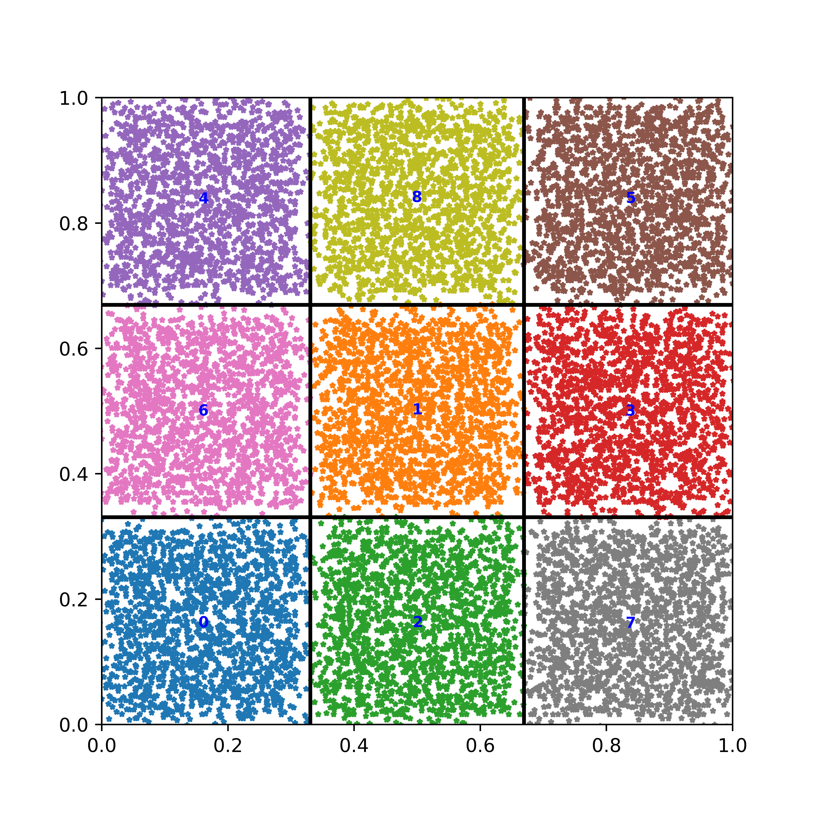
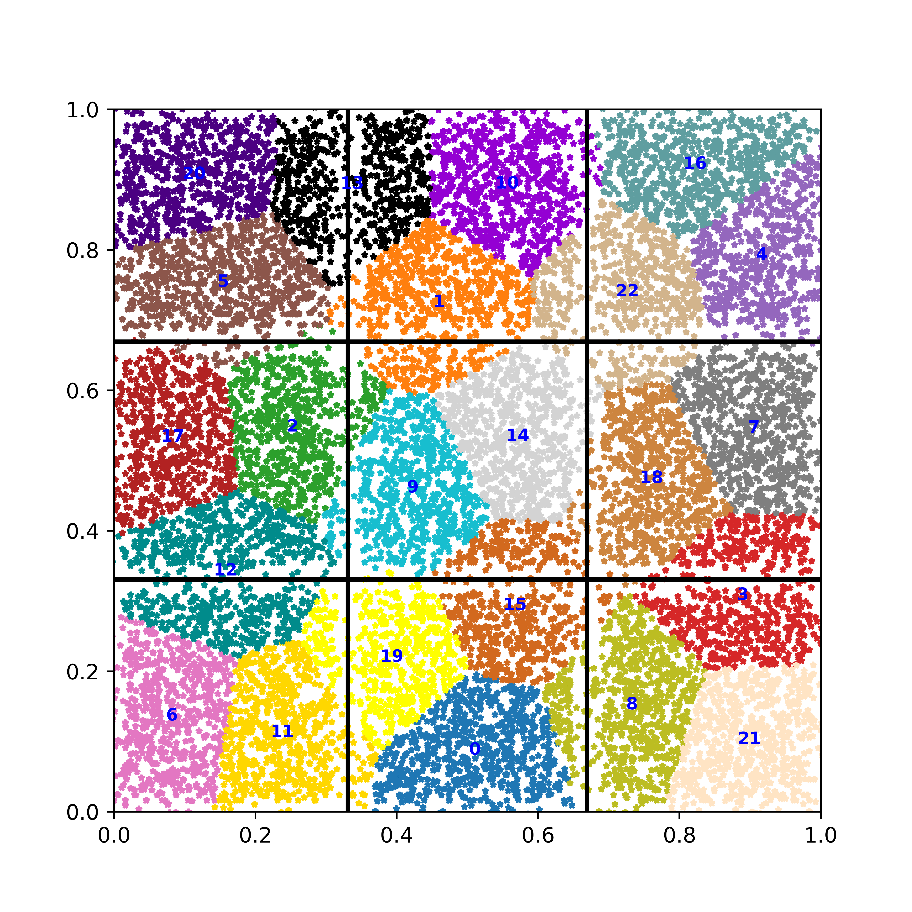
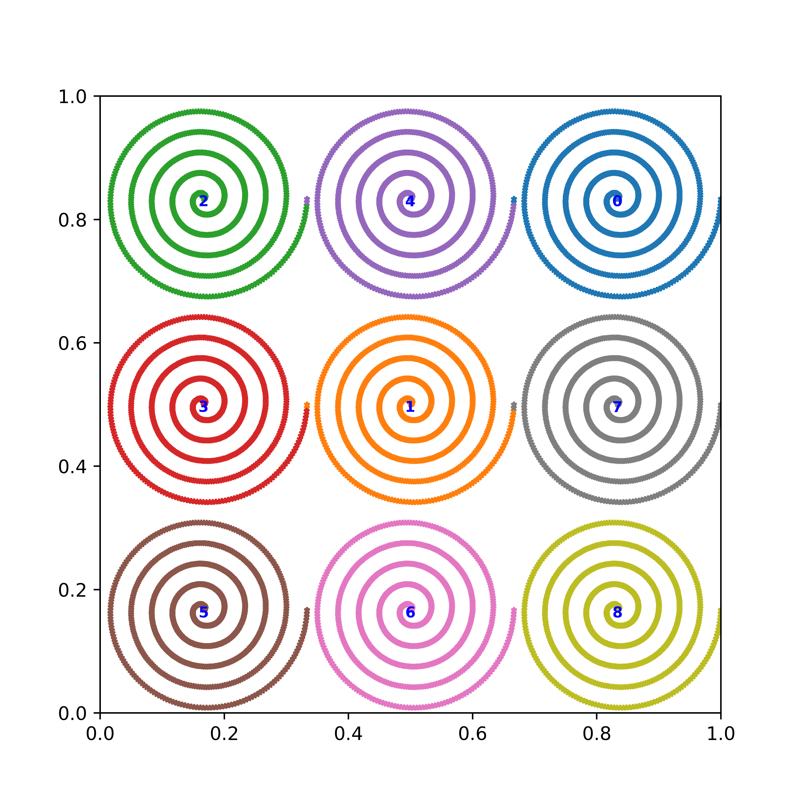
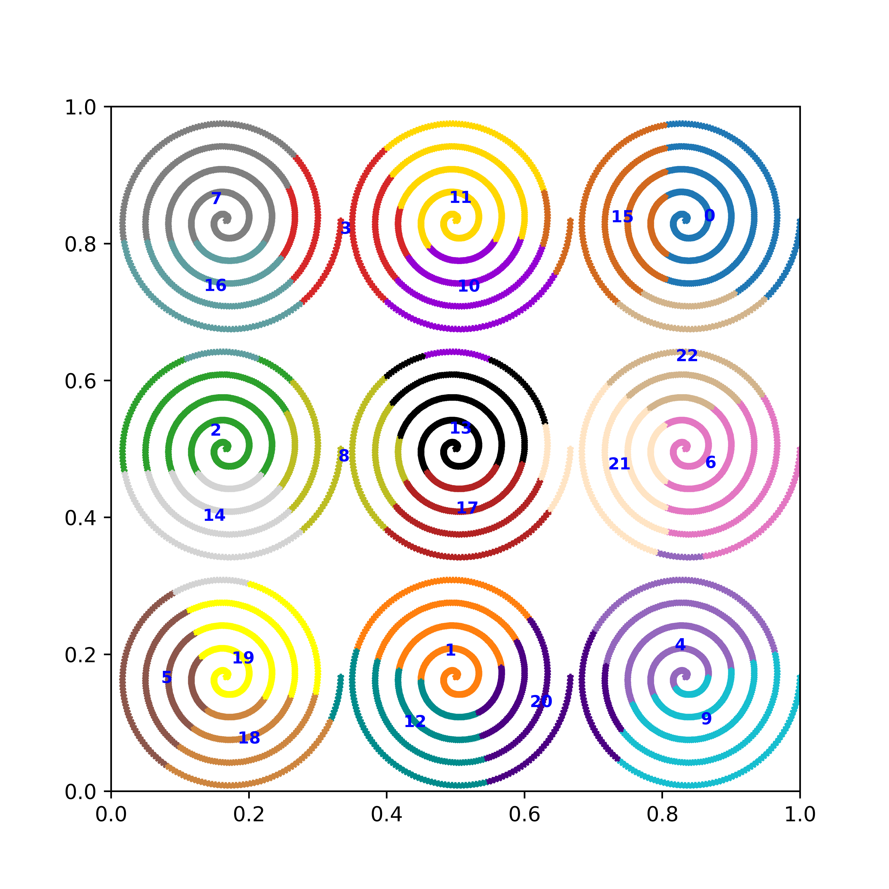

# Choosing the Optimal Number of Clusters for K-Means

This is the source code to go along with the blog article  

[Want Clusters? How Many Will You Have?](http://xplordat.com/2018/11/05/want-clusters-how-many-will-you-have/)

See the Pipfle for Python dependencies

## Usage

mkdir results

pipenv run python ./squares.py nClustersPerDim, nSize, clusterSepartionByClusterSize, resultsDir, errorFactor

	1. nClustersPerDim: The number of clusters on each dimension.
	2. nSize: Each cluster will have nSize^2 number of data points
	3. clusterSepartionByClusterSize: A measure that allows for controlling the intercluster separation versus intracluster separation. Smaller numbers place the clusters closer together
	4. resultsDir: The directory for placing the images
	5. errorFactor: A number that controls the amount of error to introduce into the location of the data points. The larger the error, the less defined the clusters are

### Square clusters

To run a 3x3 grid of clusters, with each cluster containing 40^2 (i.e. 1600) data points

	mkdir results
	pipenv run python ./squares.py 3 40 0.05 results 4.0

It will run a series of K-Means simulations with different k values, putting the following out to terminal

nClusters Per Dim, nSize, clusterSepartion/ClusterSize: 3 40 0.05  
intraClusterSize interClusterSize: 0.32258064516129026 0.016129032258064512     

nClusters, Inertia, minClusterSeparation, Inertia/minClusterSeparation^2   

2 1514.9131334164558 0.2516747599890026 6019.328809462866   
3 954.4715636440369 0.2860708526862884 3336.4865895328785   
4 609.8027773972954 0.2508796005380936 2430.659073473384   
5 505.26459411897474 0.11645850014493674 4338.580640229396  
6 413.94569370509856 0.1142182418258037 3624.1644687230837  
7 342.1028802006108 0.11858138143175845 2884.962850576042   
8 274.392281804217 0.1161828463272979 2361.7280044183835  
**9 218.67007961945131 0.11407207307160999 1916.9466612759704**   
10 206.4049059688352 0.047631760301463155 4333.34616781935   
11 194.98975798457016 0.043176755640264436 4516.081745677358   
...   
...  
13001 0.0010586678737617159 1.8797366087669693e-06 563.2001147523316  
14001 4.7830198716382e-05 4.05093801874073e-07 118.07190950616035  
14400 0.0 1.618677366850225e-14 0.0   

The metrics in **bold** indicate that the least value for 'Inertia/minClusterSeparation^2' is obtained for k=9

The 'results' folder will contain the images for the obtained clusters. Here are a couple when K-means starts out with k as 9, or k as 23

#### k = 9

#### k = 23

### Spiral clusters

To run a 3x3 grid of spiral clusters, with each cluster containing 1000 data points

	mkdir results
	pipenv run python ./spirals.py 3 1000 results

It will run a series of K-Means simulations with different k values, putting the following out to terminal

nClusters, Inertia, minClusterSeparation, Inertia/minClusterSeparation^2    
2 891.5277921002187 0.23343070050204606 3819.2396723429456   
3 556.3132136477545 0.2599211055169124 2140.3156644067008   
4 367.0317479772702 0.2249154398303224 1631.8655057836902   
5 287.21455518030797 0.11196102891598943 2565.3082859377882  
6 229.02414340106236 0.11880992382964993 1927.6516305947468  
7 178.4761157994082 0.10999436809235008 1622.5932190415567   
8 130.2241117239767 0.11022867207565919 1181.3996238165055  
**9 83.12204861150025 0.11077825365055129 750.3462626672901**  
10 79.84774422680287 0.01581574056786492 5048.625063377736   
11 76.59806090795098 0.023548127557962973 3252.8302184285044   
...   
...   
7001 0.0016255709263907159 1.0143254734869615e-06 1602.6127400729342   
8001 0.00023237561294203217 4.5003534394251386e-07 516.3496957957043   
9000 0.0 2.783341677792531e-08 0.0  

The metrics in **bold** indicate that the least value for 'Inertia/minClusterSeparation^2' is obtained for k=9

The 'results' folder will contain the images for the obtained clusters. Here are a couple when K-means starts out with k as 9, or k as 23

#### k = 9

#### k = 23

